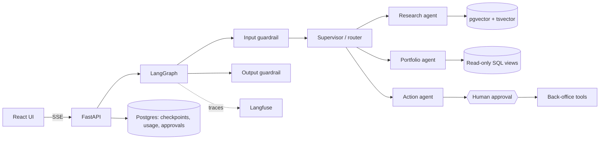

# Architecture

## 1. System overview



All persistent state lives in one Postgres instance: documents and chunks (vectors + full-text), the synthetic firm's relational data, LangGraph checkpoints, approvals, audit log and usage records.

## 2. Domain and data

A fictional firm, generated by `app/scripts/seed.py` (never real client data):

- **Relational:** `clients`, `accounts`, `instruments`, `holdings`, `transactions`, `prices`, `risk_profiles`, `tasks`.
- **Documents:** synthetic investment policy, fee schedule, product factsheets, suitability rules, compliance FAQ. Generated as Markdown/PDF so every answer is checkable. Public regulatory PDFs can be added later as a harder retrieval test.

## 3. Graph design (LangGraph)

### State

```python
class AgentState(TypedDict):
    messages: Annotated[list[AnyMessage], add_messages]
    thread_id: str
    user_id: str
    route: Literal["research", "portfolio", "action", "out_of_scope"] | None
    route_confidence: float | None
    retrieved: list[Chunk]          # for citations + eval
    sql_queries: list[SqlTrace]     # for audit + eval
    pending_action: ProposedAction | None
    guardrail_flags: list[str]
```

### Nodes

| Node | Responsibility |
|---|---|
| `input_guard` | Prompt-injection screening (heuristics + small LLM classifier). High risk: refuse, log a security event, skip all tools. |
| `supervisor` | Structured-output router returning a route plus confidence. Below threshold: ask a clarifying question instead of guessing. |
| `research_agent` | Hybrid retrieval, rerank, answer with citations. |
| `portfolio_agent` | Text-to-SQL over allow-listed views with a read-only DB role. |
| `action_agent` | Proposes mutations as `ProposedAction`. Never executes them directly. |
| `approval_gate` | `interrupt()` for HIGH-risk actions; resumes with `Command(resume=decision)`. |
| `output_guard` | Verifies each citation quote exists verbatim in a retrieved chunk; removes data about clients other than the one requested. |

Checkpointer: `PostgresSaver`, so threads survive restarts and approvals can resume hours later.

## 4. RAG pipeline

**Ingestion** (port the incremental design from `chatapp-rag-streaming`): parse per page, chunk (recursive splitter, configurable size and overlap), embed, upsert. Store a `sha256` per file; re-embed only changed files; delete chunks of removed files.

**Schema:**

```sql
CREATE EXTENSION IF NOT EXISTS vector;

CREATE TABLE documents (
  id TEXT PRIMARY KEY,
  title TEXT,
  sha256 TEXT NOT NULL,
  version INT NOT NULL DEFAULT 1,
  ingested_at TIMESTAMPTZ DEFAULT now()
);

CREATE TABLE chunks (
  id BIGSERIAL PRIMARY KEY,
  document_id TEXT REFERENCES documents(id) ON DELETE CASCADE,
  page INT,
  content TEXT NOT NULL,
  embedding VECTOR(1536),
  tsv TSVECTOR GENERATED ALWAYS AS (to_tsvector('english', content)) STORED,
  metadata JSONB DEFAULT '{}'
);
CREATE INDEX ON chunks USING hnsw (embedding vector_cosine_ops);
CREATE INDEX ON chunks USING gin (tsv);
```

**Retrieval:** vector top-k and full-text top-k, merged with Reciprocal Rank Fusion, then a cross-encoder reranker (for example a `bge-reranker` model through sentence-transformers), then top-n into the prompt. Each stage is switchable in config so the eval suite can compare them.

## 5. Tools and risk tiers

Every tool declares a tier. The tier, not the prompt, decides what happens.

| Tier | Examples | Behaviour |
|---|---|---|
| `READ` | `search_docs`, `run_sql`, `get_client` | Runs automatically. |
| `LOW` | `create_task`, `draft_email` | Runs automatically only if its feature flag is on; otherwise needs approval. |
| `HIGH` | `rebalance_portfolio`, `send_client_report` | Always interrupts for human approval. |

Rules: validate inputs with Pydantic before execution; gather context with READ tools before proposing an action; write every call (args, result, approver) to `audit_log`.

**SQL safety:** a dedicated Postgres role with `SELECT` only on `v_*` views; parse generated SQL with `sqlglot` and reject anything that is not a single SELECT; enforce a `LIMIT`; 5-second statement timeout.

## 6. API

| Method | Path | Purpose |
|---|---|---|
| POST | `/threads` | New conversation |
| POST | `/threads/{id}/messages` | Send a message; responds with an SSE stream |
| GET | `/threads/{id}` | History |
| GET | `/approvals?status=pending` | Approvals inbox |
| POST | `/approvals/{id}` | `{decision: "approve" or "reject", note}`; resumes the graph |
| POST | `/ingest` | Re-index documents |
| GET | `/documents` | List documents |
| GET | `/usage` | Tokens, cost and latency aggregates |
| GET | `/evals/latest` | Latest eval report, for the UI |

### SSE event contract (shared by backend and frontend)

```ts
type StreamEvent =
  | { type: "route"; route: string; confidence: number }
  | { type: "tool_start"; tool: string; tier: "READ" | "LOW" | "HIGH"; args: unknown }
  | { type: "tool_end"; tool: string; ms: number }
  | { type: "retrieval"; chunks: { id: number; documentId: string; page: number; score: number }[] }
  | { type: "token"; text: string }
  | { type: "approval_required"; approvalId: string; action: ProposedAction }
  | { type: "citations"; items: { documentId: string; page: number; quote: string }[] }
  | { type: "guardrail"; flag: string }
  | { type: "done"; usage: { inputTokens: number; outputTokens: number; costUsd: number; ms: number } }
  | { type: "error"; message: string };
```

Keep this in `shared/stream-events.ts` with a matching Pydantic model in `backend/app/api/events.py`. A contract test checks that both stay in sync.

## 7. Frontend

Vite, React, TypeScript, Tailwind, shadcn/ui, TanStack Query, Recharts.

| Screen | Shows |
|---|---|
| Chat | Streaming answer, route badge, collapsible agent timeline (tool calls with timings), citations drawer that opens the source page |
| Approvals | Inbox of pending actions with the context the agent gathered; approve or reject with a note |
| Documents | Indexed documents, chunk counts, re-index button |
| Usage | Cost per day, tokens per agent, p50/p95 latency |
| Evals | Latest report vs baseline, per-metric trend, failing cases |

## 8. Observability

- Langfuse callback on every graph run: one trace per request, with spans per node and tool.
- `usage` table written at the end of each run (tokens, cost, latency, route, user).
- Structured JSON logs; in AWS they go to CloudWatch.

## 9. Repository layout

```
wealthpilot/
├── backend/
│   ├── app/
│   │   ├── api/          # FastAPI routers, SSE, events.py
│   │   ├── agents/       # graph.py, state.py, nodes/
│   │   ├── rag/          # ingest.py, retrieve.py, rerank.py
│   │   ├── tools/        # registry.py, sql/, actions/
│   │   ├── guardrails/
│   │   ├── db/           # models, alembic
│   │   └── scripts/      # seed.py, ingest.py
│   └── tests/
├── evals/
│   ├── datasets/         # *.jsonl golden sets
│   ├── reports/          # JSON reports (baseline.json committed)
│   ├── thresholds.yaml
│   └── run.py
├── frontend/src/
│   ├── features/{chat,approvals,documents,usage,evals}/
│   ├── components/
│   └── lib/              # api client, SSE parser
├── shared/stream-events.ts
├── mcp-server/
├── infra/
├── docs/
├── .claude/{agents,skills}/
├── CLAUDE.md
└── docker-compose.yml
```
